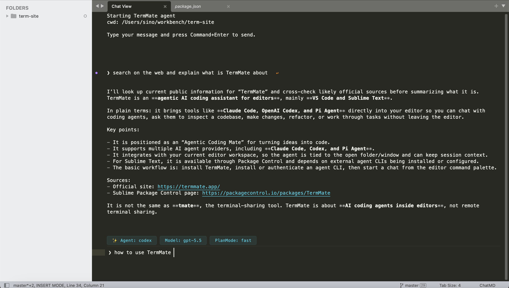

# TermMate — Agentic Coding Assistant for Sublime Text

**Claude Code, OpenAI Codex, OpenCode, and Pi coding agents for Sublime Text**



TermMate is a professional AI coding agent for Sublime Text that supports multi-agent providers, including **Claude Code**, **Codex**, **[OpenCode](https://opencode.ai)**, and **[Pi Agent](https://pi.dev)**. It builds a seamless native agentic interface directly within your editor for autonomous task execution, codebase exploration, and smart refactoring. Instead of using conventional webview, TermMate provides editor-native, REPL-inspired chat interface with modern editor features such as goto-navigation, auto-complete, folding, file links.

See TermMate agentic coding features — **[live demo here →](https://termmate.app/sublime/)**

TermMate's main agentic features include:

- **autonomous coding workflow** - let agents explore your codebase, run commands, edit files, and complete tasks directly in Sublime Text.
- **editor-native chat** - plan tasks, follow tool execution, approve agent actions, and review changes in an editor-native interface.
- **workspace awareness** - reference files, line ranges, selections, and multi-level directory paths with cascading smart `@` completion and sidebar actions.
- **session management** - start fresh, resume previous conversations, or rewind and branch from earlier prompt.

## Getting Started

### 1. TermMate Installation

Install TermMate via [Package Control](https://packagecontrol.io/packages/TermMate):

1. Open the Command Palette (`Cmd+Shift+P` on macOS, `Ctrl+Shift+P` on Windows/Linux).
2. Type `Package Control: Install Package` and press `Enter`.
3. Search for `TermMate` and press `Enter`.

### 2. Install Agent CLI

If Claude Code, Codex, OpenCode, or Pi Agent is already installed and authenticated, **skip this step**. TermMate automatically detects existing CLI installations and uses their current authentication — no extra setup needed.

Otherwise, the easiest way is to install directly from within Sublime Text: open the Command Palette, type `TermMate: Install Agent`, and select the agent you want. TermMate will run the installation in dedicated panel and notify you when it's complete. CLIs are installed to `~/.local/bin` on macOS/Linux and `%APPDATA%\npm` on Windows.

Alternatively, manually install an agent from your terminal:

```shell
# Claude Code
curl -fsSL https://claude.ai/install.sh | bash

# Codex (macOS/Linux)
curl -fsSL https://chatgpt.com/codex/install.sh | sh
# Codex (Windows PowerShell)
powershell -ExecutionPolicy ByPass -c "irm https://chatgpt.com/codex/install.ps1 | iex"

# OpenCode (macOS/Linux)
curl -fsSL https://opencode.ai/install | bash
# OpenCode (Windows)
npm install -g opencode-ai

# Pi Agent
curl -fsSL https://pi.dev/install.sh | sh
```

> **Note:** TermMate automatically detects CLI installation paths across multiple environments, including **Homebrew**, **npm-global**, **Yarn**, and common local binary directories. You typically don't need to manually configure environment variables or search paths.


### 3. Authentication

Authenticate the agents via your terminal, or skip the CLI login by setting API keys directly in TermMate's settings — see [Custom Environment Variables](#custom-environment-variables).

**Claude Code:**

```bash
/login
```

**Codex:**

```bash
codex login
```

**OpenCode:**

```bash
/connect
```

**Pi Agent:**

```bash
/login
```

Alternatively, you can use `env` settings to skip the CLI login. Open the settings file via **Preferences → Package Settings → TermMate → Settings** and add env:

```json
{
    "env": {
        "GEMINI_API_KEY": "your-gemini-api-key"
    }
}
```

The example above sets `GEMINI_API_KEY` for Pi Agent authentication.

### 4. Start Chat

- Open the command palette (`Cmd+Shift+P` on macOS, `Ctrl+Shift+P` on Windows/Linux).
- Type `TermMate: Start Chat` and press `Enter`.
- A new chat view will open for the TermMate chat.
- Type your message and press `Cmd+Enter` (macOS) or `Ctrl+Enter` (Windows/Linux) to send. You can even edit prompts in Vim mode.

You can stop a running conversation at any time. Use the shortcut `Cmd+Escape` (Mac) / `Shift+Escape` (Windows/Linux) in the chat window, or run `TermMate: Stop Conversation` from the command palette.

For a detailed guide, see the [TermMate Documentation](https://termmate.app/docs/setup).

## Usage & Key Features

**1. Chat with Agent about Current File or Selection**

Right-click on any file or text selection and choose **TermMate: Chat with Agent** to send it as context for your next prompt. This will:

- Open the TermMate chat view (if not already open).
- Insert a reference to the file (`@filename`) or selected line range (`@filename#L1-10`) into the message prompt.
- Tagged files will be automatically sent as context to the active agent.

**2. File Tags `@` Smart Completion**

Tag files in your prompt to give the agent precise project context. Typing `@` in the chat input instantly opens a completion popup with multi-level directory drilling:

- 📁 Subdirectories & cascading navigation — selecting a folder (e.g. `src/`) automatically cascades into its subdirectories and files without re-typing `@`
- 📄 Workspace files — files in the active workspace root
- 📦 Multi-root workspaces — drill into secondary workspace folders
- 📂 Open files — files currently open in editor tabs

A tag can point at a file (`@src/main.py`), a line or range (`@src/main.py#L42`, `@src/main.py#L10-25`), or a directory (`@src/`). Tagged files are sent to the agent as context along with your message. **Chat with Agent** and the sidebar context menu can also insert tags for you.

**3. Set Working Directory**

Right-click on any folder in the sidebar and select **Set Working Directory** to choose the agent's primary working directory (`cwd`). This is the default directory used when the agent runs commands or accesses relative paths. You can also use `TermMate: Set Working Directory` from the command palette.

For sublime projects with multi-folder open in the same workspace, TermMate keeps the selected folder as the `cwd` and gives the agent access to the other folders as additional directories. This is equivalent to agent's `add-dir` option.

**4. Quick Message**

Run `TermMate: Quick Message` from the command palette to compose and send a message directly from the current tab. If text is selected, TermMate automatically includes its file and line range as context. The message is sent to the existing chat, or a new chat is started if needed.

**5. Split Chat Window**

You can use the command palette (`TermMate: Split Chat Window`) or right-click the chat view tab and select **TermMate: Split Chat Window** to split the editor layout and place the chat view into its own dedicated pane. By default, this pane is isolated so opening other files will not overwrite the chat view. This isolation behavior can be configured via the `dedicated_chat_pane` setting.

## Advanced Control

### Plan Mode

Switch between two execution styles from the Command Palette: `TermMate: Plan Mode`

| Mode | Behavior |
| :--- | :--- |
| **Fast** (default) | Agent acts immediately — no intermediate steps shown. |
| **Planning** | Agent outlines a step-by-step plan before doing anything. Useful for large or risky changes. |

### Approve Mode

Control how much the agent can do without asking you first: `TermMate: Approve Mode`

| Mode | Behavior |
| :--- | :--- |
| **Default** | Prompts you before every tool action. |
| **Allow Edit** | Auto-approves safe read/edit operations; still prompts for shell commands. |
| **Accept All** | Auto-approves everything, including shell execution. Maximum autonomy. |

### Switch Agent

Use `TermMate: Switch Agent` to swap between Claude, Codex, OpenCode, and Pi Agent at any time.

### Select Model

Use `TermMate: Select Model` to pick a specific LLM model per agent (e.g. `claude-opus-4-5` vs `claude-sonnet-4-5`).

## Artifact

### file changes artifact

The artifact panel shows generated files and file changes produced during the conversation. When the agent edits code, a summary appears in the panel listing every modified file along with the number of lines added and removed.

```
▣ 2 files changed
    src/foo.py  +12 -3
    src/bar.py  +5 -1
```

Click a file entry to jump directly to the file in the editor. Artifacts are folded by default. Click the `▶` arrow in the gutter to expand and view the full diff inline.

## Session Management: Clear, Resume & Rewind

**1. Clear Session**

To reset the current conversation history and start a completely fresh context, open the command palette and run **`TermMate: Clear Session`**. This will reload the agent and clear its memory for the current workspace.

**2. Resume Previous Conversation**

Run **`TermMate: Resume Session`** from the command palette to continue a past conversation. A quick panel lists previous sessions for the current workspace, each showing a short summary and timestamp. Select one and the agent picks up exactly where it left off.

**3. Rewind Conversation**

Hover over any gutter dot or click the `↩` button that appears at the prompt line to rewind the conversation to that point. A confirmation panel lets you confirm or cancel before the rewind takes effect.

When confirmed, TermMate forks the session at the selected prompt, removes all subsequent messages from the chat view - letting you explore a different direction without losing the original context.

## Shortcuts & Commands

| Action | macOS | Windows/Linux | Command Palette |
| :--- | :--- | :--- | :--- |
| **Install Agent** | - | - | `TermMate: Install Agent` |
| **Start New Chat** | - | - | `TermMate: Start Chat` |
| **Quick Message** | - | - | `TermMate: Quick Message` |
| **Split Chat Window** | - | - | `TermMate: Split Chat Window` |
| **Send Message** | `Cmd+Enter` | `Ctrl+Enter` | - |
| **Stop Conversation** | `Cmd+Escape` | `Shift+Escape` | `TermMate: Stop Conversation` |
| **Navigate Input History** | `Up` / `Down` | `Up` / `Down` | - |
| **Mention File** | `@` | `@` | - |
| **Set Workspace** | - | - | `TermMate: Set Working Directory` |
| **Plan Mode** | - | - | `TermMate: Plan Mode` |
| **Approve Mode** | - | - | `TermMate: Approve Mode` |

## Configuration

Customize TermMate by editing your settings: `Preferences -> Package Settings -> TermMate -> Settings`

### Agent CLI Paths

While TermMate automatically detects most agent CLI installation paths, you may need to configure them manually if:

- You use a custom installation location not listed in the default paths.
- You have multiple versions installed and want to pin a specific binary.
- Automatic detection fails on your specific OS configuration.

```json
{
    "claude_command": "/path/to/your/custom/claude",
    "codex_command": "/path/to/your/custom/codex",
    "opencode_command": "/path/to/your/custom/opencode",
    "pi_command": "/path/to/your/custom/pi"
}
```

### Custom Environment Variables

The `env` configuration allows you to inject custom environment variables directly into the process when starting an agent CLI command. This is useful for providing API keys, custom base URLs, or passing specific environment values without altering your global system configuration.

**Example: OpenRouter for Claude**

Set a custom base URL and auth token so Claude routes through OpenRouter (`ANTHROPIC_API_KEY` must be empty in this case):

```json
{
    "env": {
        "ANTHROPIC_BASE_URL": "https://openrouter.ai/api/v1",
        "ANTHROPIC_AUTH_TOKEN": "sk-openrouter-token",
        "ANTHROPIC_API_KEY": ""
    }
}
```

**Example: Gemini API key for OpenCode**

OpenCode uses the `GOOGLE_GENERATIVE_AI_API_KEY` environment variable. Set it here to authenticate without modifying your system environment (you may need to remove existing local auth.json via delete `~/.local/share/opencode/auth.json` first):

```json
{
    "env": {
        "GOOGLE_GENERATIVE_AI_API_KEY": "your-gemini-api-key"
    }
}
```

### Custom Keybindings

By default, TermMate does not register a shortcut for `TermMate: Start Chat` to avoid conflicts. You can manually add a shortcut (`Cmd+Option+G` on macOS, `Ctrl+Alt+G` on Windows/Linux) by navigating to `Preferences -> Key Bindings` and adding the following configuration:

```json
[
    {
        "keys": ["primary+alt+g"],
        "command": "term_chat_cli",
        "args": {},
        "context":
        [
            { "key": "setting.is_widget", "operand": false }
        ]
    }
]
```

To add the current file location or selected lines to **Chat with Agent**, configure `Cmd+Option+K` on macOS or `Ctrl+Alt+K` on Windows/Linux:

```json
[
    {
        "keys": ["primary+alt+k"],
        "command": "term_chat_add_context",
        "context":
        [
            { "key": "setting.is_widget", "operand": false }
        ]
    }
]
```

### Additional Settings

These settings can be added or changed in `Preferences → Package Settings → TermMate → Settings`:

| Setting | Description | Values / default |
| :--- | :--- | :--- |
| `table_style` | Controls how Markdown tables are rendered in the Chat | `"bordered"`, `"markdown"`, or `"html"`; default: `"html"` |
| `diff_fold_limit` | Automatically folds a diff when it contains more than this many diff lines  | default: `200` (to show complete diff much as possible); set to `0` to keep all diffs expanded |
| `dedicated_chat_pane` | Keeps the Chat tab in a dedicated pane so files opened elsewhere do not replace it. | `true` or `false`; default: `true` |
| `show_status_indicator` | Whether to display model indicator `claude(sonnet)` in status bar | `true` or `false`; default: `true` |

## 💡 TermMate Agent Tips

- **Selection as Context**: Select code before starting a chat to focus the agent's attention on specific logic.
- **Iterative Refinement**: Use **Planning Mode** for large architectural changes to see the agent's proposed steps before they are applied.
- **Reviewing Changes with GitSavvy**: Use [GitSavvy](https://packagecontrol.io/packages/GitSavvy)'s `git: diff` command to review file diffs after the agent makes edits — the inline diff view makes it easy to inspect, stage, or discard individual hunks.

## Privacy & Data Handling

**TermMate does not send your entire workspace or file contents to any external servers.**

Your data will only be sent to the respective LLM services used by Claude Code, Codex, OpenCode, or Pi under the following specific conditions:

**What data is sent:**

- Any text you manually type into the TermMate ChatView.
- The contents of specific files you explicitly tag using the `@filename` syntax.
- The outputs of shell commands, directory listings, or file contents that the agent explicitly requests to read.

**How TermMate interacts with Agents:**

- **Local Execution**: The core plugin logic runs entirely on your local machine. All communication happens locally via the official CLI tools (`claude`, `codex`, or `pi`) installed on your system.
- **No Data Collection**: TermMate does not collect, store, or transmit any of your source code or usage telemetry to our servers. TermMate does not send data to any third-party middleman servers; data goes directly to Anthropic or OpenAI using your own configured authentication credentials.
- Data is only sent when you actively hit command+enter(or ctrl+enter) in the ChatView, or when the agent executes a tool (if you have granted permission via your `Approve Mode` settings).


## License

TermMate is provided under the **Apache License, Version 2.0** with the **Commons Clause** condition.

This means it's free to use, modify, and redistribute the code for personal or internal use. However, **commercial resale or providing a paid service is strictly prohibited**.

For complete details, please see the [LICENSE](LICENSE) file.
